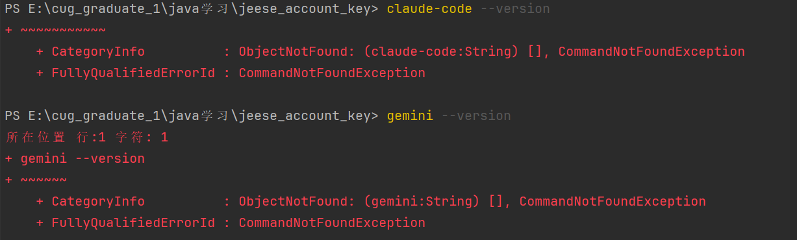

## 安装 AI 开发工具

确认 Node.js 版本为 18+ 后，可以安装以下工具：

### Claude Code

```powershell
npm install -g @anthropic-ai/claude-code
```

### Gemini CLI（正确包名）

```powershell
npm install -g @google/gemini-cli
```


## 验证安装

```powershell
# 检查 Claude Code
claude --version

# 检查 Gemini CLI
gemini --version

# 查看帮助信息
claude-code --help
gemini --help
```


## 错误排查



**上述情况应该是因为windows的环境变量问题。**


**先检查全局包安装位置：**

```powershell
# 查看 npm 全局包安装路径
npm config get prefix

# 查看已安装的全局包
npm list -g --depth=0
```

然后得到路径这个很重要，我这里的案例是

```powershell
ls "C:\Users\jeese\AppData\Roaming\npm"
```


## 解决方法

### 步骤1：检查文件是否存在

```powershell
ls "C:\Users\jeese\AppData\Roaming\npm"
```

### 步骤2：临时添加到 PATH（立即生效）

```powershell
$env:PATH += ";C:\Users\jeese\AppData\Roaming\npm"
```

### 步骤3：永久添加到 PATH

1. 按 `Win + X`，选择"系统"
2. 点击"高级系统设置" → "环境变量"
3. 在"系统变量"中找到 `Path`，点击"编辑"
4. 点击"新建"，添加：`C:\Users\jeese\AppData\Roaming\npm`
5. 确定保存
6. 如果还是有问题的话，可以尝试在用户变量中的 `Path`添加：`C:\Users\jeese\AppData\Roaming\npm`

### 步骤4：验证

```powershell
# 重新打开 PowerShell，然后测试
claude --version
gemini --version
```


## 使用方法

### Claude Code

```powershell
# 启动 Claude Code
claude

# 在特定目录中使用
cd your-project-folder
claude
```


### Gemini CLI

```powershell
# 启动 Gemini CLI
gemini

# 首次使用需要用 Google 账号认证
```

