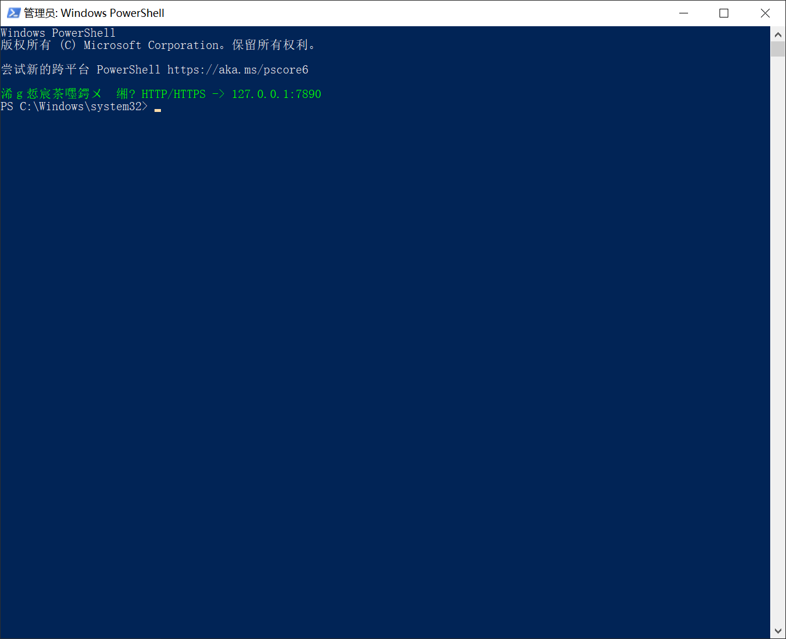

# PowerShell 代理配置完整指南

## 永久配置代理（推荐方法）

### 步骤 1：检查并创建配置文件

1. **检查配置文件是否存在**：

```powershell
Test-Path $PROFILE
```

1. **如果返回 False，创建配置文件**：

```powershell
New-Item -Type File -Path $PROFILE -Force
```

1. **编辑配置文件**：

```powershell
notepad $PROFILE
```

### 步骤 2：添加基础代理配置

在打开的记事本中添加以下内容：

```powershell
# 设置代理环境变量
$env:HTTP_PROXY = "http://127.0.0.1:7890"
$env:HTTPS_PROXY = "http://127.0.0.1:7890"

Write-Host "代理已自动设置: HTTP/HTTPS -> 127.0.0.1:7890" -ForegroundColor Green
```


### 步骤 3：添加代理控制函数（可选但懒得搞）

在配置文件中继续添加：

```powershell
# 代理控制函数
function Enable-Proxy {
    $env:HTTP_PROXY = "http://127.0.0.1:7890"
    $env:HTTPS_PROXY = "http://127.0.0.1:7890"
    Write-Host "代理已启用: HTTP/HTTPS -> 127.0.0.1:7890" -ForegroundColor Green
}

function Disable-Proxy {
    $env:HTTP_PROXY = $null
    $env:HTTPS_PROXY = $null
    Write-Host "代理已禁用" -ForegroundColor Red
}

function Show-Proxy {
    if ($env:HTTP_PROXY) {
        Write-Host "当前代理: $env:HTTP_PROXY" -ForegroundColor Cyan
    } else {
        Write-Host "当前未设置代理" -ForegroundColor Yellow
    }
}
```

1. **保存文件并关闭记事本**


## 解决执行策略限制

如果遇到"禁止运行脚本"错误，需要修改执行策略：

### 解决方法

1. **以管理员身份运行 PowerShell**：
   - 按 `Win + X`，选择"Windows PowerShell (管理员)"
   - 或者右键 PowerShell 图标，选择"以管理员身份运行"
2. **修改执行策略**：

```powershell
Set-ExecutionPolicy -ExecutionPolicy RemoteSigned -Scope CurrentUser
```

1. **当提示是否更改执行策略时，输入 Y 确认**
2. **关闭管理员 PowerShell，重新打开普通 PowerShell**


## 临时禁用代理

当某个 PowerShell 窗口临时不想使用代理时：

### 方法一：临时清除环境变量

```powershell
# 临时禁用代理
$env:HTTP_PROXY = $null
$env:HTTPS_PROXY = $null
Write-Host "代理已临时禁用" -ForegroundColor Yellow
```


### 方法二：使用自定义函数（如果已添加）

```powershell
# 禁用代理
Disable-Proxy

# 启用代理
Enable-Proxy

# 查看代理状态
Show-Proxy
```


## 验证配置

### 检查环境变量

```powershell
echo $env:HTTP_PROXY
echo $env:HTTPS_PROXY
```

### 测试网络连接

```powershell
# 测试访问被墙网站
curl -I https://www.google.com

# 查看当前 IP（验证是否走代理）
curl https://ipinfo.io/ip
```


然后每次开启的时候会有乱码，但是比较正常




## 常见问题

### Q: 为什么选择端口 7890？

A: 这是 Clash 默认的 HTTP 代理端口，可以在 Clash 界面右上角看到。

### Q: 配置后重启电脑还有效吗？

A: 有效。PowerShell 配置文件会在每次启动 PowerShell 时自动加载。

### Q: 如何完全删除配置？

A: 删除或注释掉 `$PROFILE` 文件中的相关内容即可。

### Q: 这样配置会影响其他应用吗？

A: 不会。这只影响从该 PowerShell 窗口启动的命令行工具。